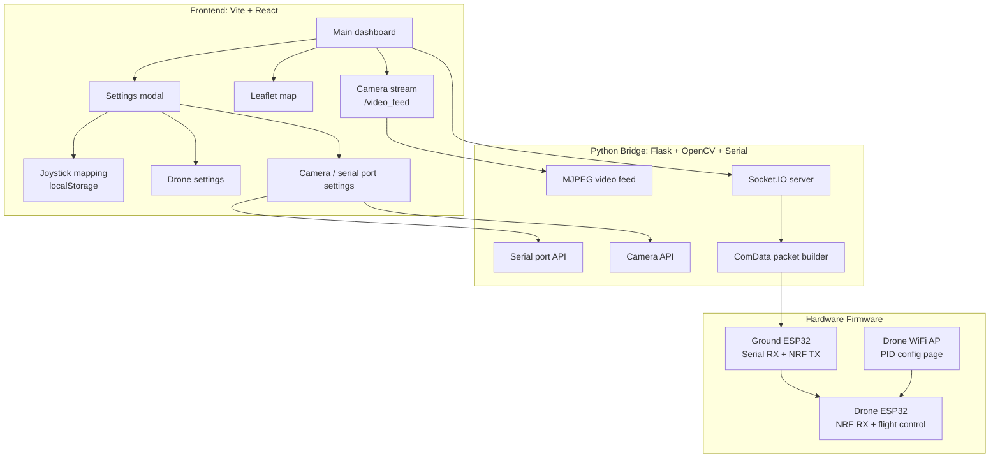
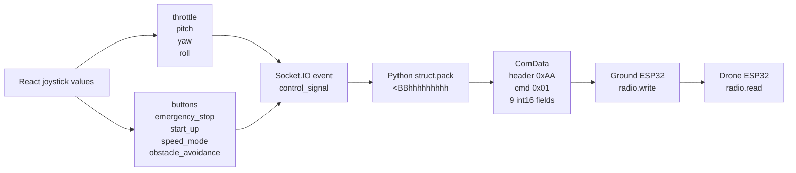
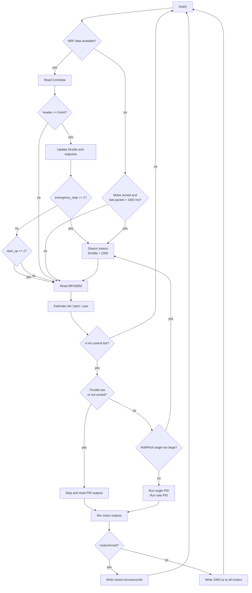
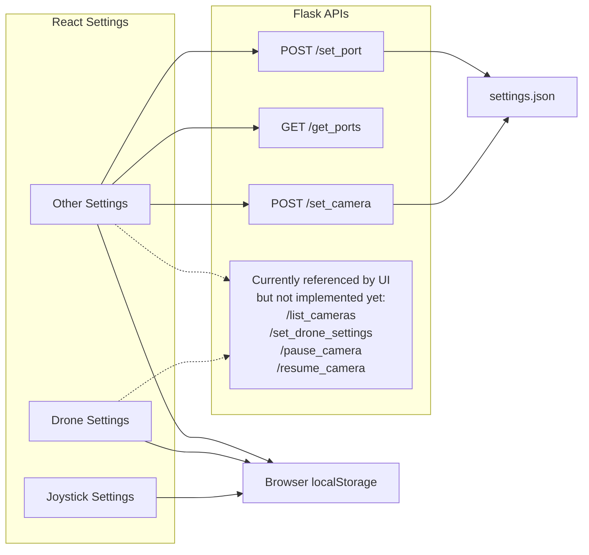

# ESP32 Drone Flowchart

## Overall Control Flow

```mermaid
flowchart LR
    User["Pilot"]
    Gamepad["Gamepad<br/>Browser Gamepad API"]
    React["React Control UI<br/>esp32Drone/src/App.tsx"]
    Socket["Socket.IO Client<br/>control_signal"]
    Flask["Python Flask + Socket.IO<br/>esp32Drone/python/cv.py"]
    Serial["USB Serial<br/>Binary ComData Packet"]
    Ground["Ground ESP32<br/>hardware/ground.cpp"]
    NRF["NRF24L01 Radio Link<br/>Channel 100"]
    Drone["Drone ESP32<br/>hardware/drone.cpp"]
    PID["MPU6050 + PID Control"]
    Motors["ESC / Motors<br/>FL FR BL BR"]

    User --> Gamepad
    Gamepad --> React
    React --> Socket
    Socket --> Flask
    Flask --> Serial
    Serial --> Ground
    Ground --> NRF
    NRF --> Drone
    Drone --> PID
    PID --> Motors
```

## Software Layers

```mermaid
flowchart TB
    subgraph Frontend["Frontend: Vite + React"]
        UI["Main dashboard"]
        CameraView["Camera stream<br/>/video_feed"]
        Map["Leaflet map"]
        Settings["Settings modal"]
        JoystickSettings["Joystick mapping<br/>localStorage"]
        DroneSettings["Drone settings"]
        OtherSettings["Camera / serial port settings"]

        UI --> CameraView
        UI --> Map
        UI --> Settings
        Settings --> JoystickSettings
        Settings --> DroneSettings
        Settings --> OtherSettings
    end

    subgraph Python["Python Bridge: Flask + OpenCV + Serial"]
        VideoFeed["MJPEG video feed"]
        SocketServer["Socket.IO server"]
        PortApi["Serial port API"]
        CameraApi["Camera API"]
        PacketBuilder["ComData packet builder"]
    end

    subgraph Hardware["Hardware Firmware"]
        GroundTx["Ground ESP32<br/>Serial RX + NRF TX"]
        DroneRx["Drone ESP32<br/>NRF RX + flight control"]
        WebPid["Drone WiFi AP<br/>PID config page"]
    end

    CameraView --> VideoFeed
    OtherSettings --> CameraApi
    OtherSettings --> PortApi
    UI --> SocketServer
    SocketServer --> PacketBuilder
    PacketBuilder --> GroundTx
    GroundTx --> DroneRx
    WebPid --> DroneRx
```

## Control Signal Packet

```mermaid
flowchart LR
    A["React joystick values"]
    B["throttle<br/>pitch<br/>yaw<br/>roll"]
    C["buttons<br/>emergency_stop<br/>start_up<br/>speed_mode<br/>obstacle_avoidance"]
    D["Socket.IO event<br/>control_signal"]
    E["Python struct.pack<br/>&lt;BBhhhhhhhhh"]
    F["ComData<br/>header 0xAA<br/>cmd 0x01<br/>9 int16 fields"]
    G["Ground ESP32<br/>radio.write"]
    H["Drone ESP32<br/>radio.read"]

    A --> B
    A --> C
    B --> D
    C --> D
    D --> E
    E --> F
    F --> G
    G --> H
```

## Drone Runtime Loop

```mermaid
flowchart TD
    Start["loop()"]
    RadioCheck{"NRF data available?"}
    ReadPacket["Read ComData"]
    HeaderCheck{"header == 0xAA?"}
    UpdateControl["Update throttle and setpoints"]
    Emergency{"emergency_stop == 1?"}
    Arm{"start_up == 1?"}
    SignalLost{"Motor armed and<br/>last packet > 1000 ms?"}
    Disarm["Disarm motors<br/>throttle = 1000"]
    Sensors["Read MPU6050"]
    Estimate["Estimate roll / pitch / yaw"]
    ControlTick{"4 ms control tick?"}
    SafeState{"Throttle low<br/>or not armed?"}
    AngleLimit{"Roll/Pitch angle too large?"}
    ResetPID["Stop and reset PID outputs"]
    RunPID["Run angle PID<br/>Run rate PID"]
    MixMotors["Mix motor outputs"]
    WriteMotors{"motorArmed?"}
    ArmedOutput["Write mixed microseconds"]
    IdleOutput["Write 1000 us to all motors"]

    Start --> RadioCheck
    RadioCheck -- yes --> ReadPacket
    ReadPacket --> HeaderCheck
    HeaderCheck -- yes --> UpdateControl
    UpdateControl --> Emergency
    Emergency -- yes --> Disarm
    Emergency -- no --> Arm
    Arm -- yes --> Sensors
    Arm -- no --> Sensors
    HeaderCheck -- no --> Sensors

    RadioCheck -- no --> SignalLost
    SignalLost -- yes --> Disarm
    SignalLost -- no --> Sensors
    Disarm --> Sensors

    Sensors --> Estimate
    Estimate --> ControlTick
    ControlTick -- no --> Start
    ControlTick -- yes --> SafeState
    SafeState -- yes --> ResetPID
    SafeState -- no --> AngleLimit
    AngleLimit -- yes --> Disarm
    AngleLimit -- no --> RunPID
    ResetPID --> MixMotors
    RunPID --> MixMotors
    MixMotors --> WriteMotors
    WriteMotors -- yes --> ArmedOutput
    WriteMotors -- no --> IdleOutput
    ArmedOutput --> Start
    IdleOutput --> Start
```

## Settings And APIs

```mermaid
flowchart LR
    LocalStorage["Browser localStorage"]
    SettingsJson["settings.json"]

    subgraph React["React Settings"]
        Joy["Joystick Settings"]
        DroneSet["Drone Settings"]
        Other["Other Settings"]
    end

    subgraph Flask["Flask APIs"]
        SetCamera["POST /set_camera"]
        GetPorts["GET /get_ports"]
        SetPort["POST /set_port"]
        MissingApis["Currently referenced by UI<br/>but not implemented yet:<br/>/list_cameras<br/>/set_drone_settings<br/>/pause_camera<br/>/resume_camera"]
    end

    Joy --> LocalStorage
    DroneSet --> LocalStorage
    Other --> LocalStorage
    Other --> SetCamera
    Other --> GetPorts
    Other --> SetPort
    SetCamera --> SettingsJson
    SetPort --> SettingsJson
    DroneSet -.-> MissingApis
    Other -.-> MissingApis
```
